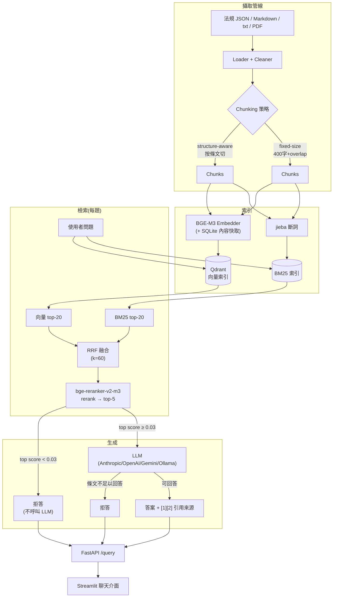

# 繁體中文 Hybrid RAG 知識問答系統

[](https://github.com/tun0000/hybird-rag-law-QA/actions/workflows/ci.yml)

以台灣 15 部勞動法規為知識庫的檢索增強生成(RAG)問答系統:BM25 + BGE-M3 向量檢索以 RRF 融合,經 bge-reranker-v2-m3 重排序後生成附條文引用的答案,回答附上「哪份法規哪一條」的引用來源,查無依據時誠實拒答而非瞎掰。全部設計決策都有 40 題評估集與 8 組消融實驗的實測數據支撐——見 [EVAL_REPORT.md](EVAL_REPORT.md)。

## 架構



## Quickstart

需求:Python 3.11、[uv](https://docs.astral.sh/uv/)。有 NVIDIA GPU 可大幅加速 embedding/rerank,純 CPU 也能跑(較慢)。

```bash
# 1. 安裝依賴
uv sync

# 2. 設定環境變數(至少填一組 LLM key:Anthropic / OpenAI / Gemini 擇一,或改用本機 Ollama)
cp .env.example .env
# 編輯 .env,填入 LLM_PROVIDER 與對應的 API key

# 3. 下載語料(全國法規資料庫官方開放資料,約 30MB,首次執行)
uv run python scripts/download_corpus.py

# 4. 建索引(向量 + BM25,兩種 chunking 策略各一份;有 GPU 約 1 分鐘)
uv run python scripts/build_index.py

# 5. 命令列問答(開發用,免啟動伺服器)
uv run python scripts/ask.py "加班費怎麼算?"

# 6. 或啟動 API + 前端
uv run python scripts/run_api.py &          # http://localhost:8000/docs
uv run streamlit run ui/app.py              # http://localhost:8501
```

### 用 Docker(Qdrant server mode)

```bash
docker compose up -d qdrant
QDRANT_MODE=server uv run python scripts/build_index.py   # 對 Qdrant 服務建索引
docker compose up --build api ui
```

### 跑測試與評估

83 個單元測試不依賴 GPU 或真實 LLM API(heavy model 皆延遲載入,測試只走 mock/cache 路徑),每次 push 會由 [GitHub Actions](.github/workflows/ci.yml) 自動執行。

```bash
uv run pytest                                    # 83 個單元測試
uv run python eval/run_retrieval_eval.py         # 迷你評估集(10題)retrieval 指標
uv run python eval/ablation.py                   # 8 組消融實驗(40題,零 LLM 成本)
uv run python eval/run_e2e_eval.py               # 端到端生成品質(LLM-as-judge)
```

### Demo 截圖

<!-- TODO: 補上 Streamlit UI 問答畫面截圖,建議放 docs/screenshot-*.png -->

## 技術棧

| 元件 | 選擇 |
|---|---|
| Embedding | BGE-M3(FlagEmbedding,支援 CUDA) |
| Reranker | bge-reranker-v2-m3 |
| Vector DB | Qdrant(local 檔案模式 / server 模式雙支援) |
| 關鍵字檢索 | rank_bm25 + jieba(繁中詞典 + 勞動法規自訂詞) |
| 融合 | Reciprocal Rank Fusion |
| LLM | Anthropic / OpenAI / Gemini / Ollama,環境變數切換 |
| API / 前端 | FastAPI / Streamlit |
| 評估 | 自建 LLM-as-judge(faithfulness + relevancy)+ retrieval 指標(hit rate、MRR) |

每個選擇的理由與 tradeoff 見 [DESIGN.md](DESIGN.md)。

## 專案文件

- [plan.md](plan.md) — 開發計畫與各階段進度
- [DESIGN.md](DESIGN.md) — 技術選型理由與 tradeoff
- [EVAL_REPORT.md](EVAL_REPORT.md) — 評估數據、消融實驗、失敗案例分析
- [INTERVIEW_PREP.md](INTERVIEW_PREP.md) — 面試常見追問與回答要點
- [eval/dataset/README.md](eval/dataset/README.md) — 評估集 schema 與出題原則

## 資料來源與授權

知識庫語料為 15 部台灣勞動法規(勞動基準法、勞工退休金條例、性別平等工作法等),來自[全國法規資料庫](https://law.moj.gov.tw/)開放資料(政府資料開放授權條款 OGDL),由 `scripts/download_corpus.py` 於執行時下載,不隨 repo 散布(見 `.gitignore`)。
